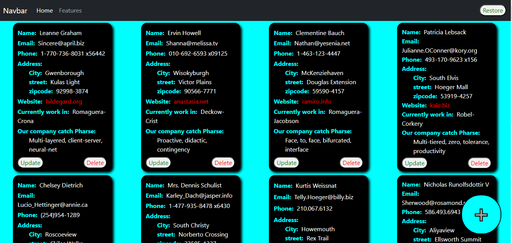
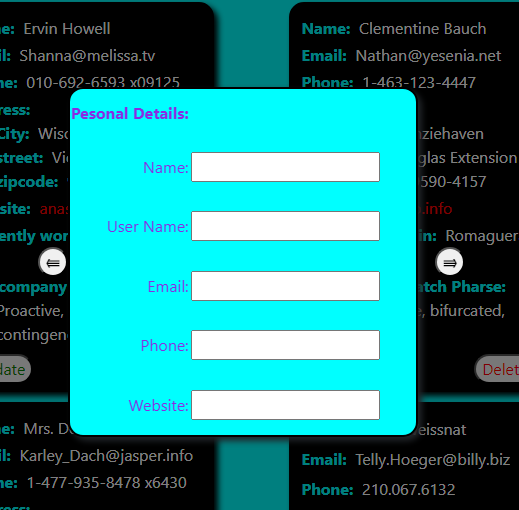
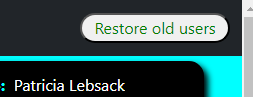

## AXIOS_TASK

# HOW TO RUN THE APPLICATION

- First clone the repository

- Open cmd on the same path

- Then run npm install

- And then npm install axios

- Then npm run dev

# WORK ON APPLICATION
- This is application main page

- You want add new user to click the plus icon

- And it's show popup 

- Enter the detailes and add a user

- If you want delete the existing user click the delete button

- If you want update the existing user detalis click the update button

- If you can also restore old user from this site https://jsonplaceholder.typicode.com/users/ 

 

